<div align="center">

<!-- # Zuri
**Mumbai's Premium AI-Powered Salon Marketplace** -->

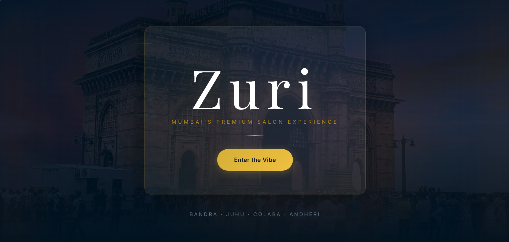

[](#)
[](#)
[](#)
[](#)

</div>

<br />

## Introduction
<br>

**Welcome to Zuri**.

We built this platform because we believe that finding the right salon shouldn't feel like a gamble, and running a premium salon shouldn't mean fighting against fake reviews.

Zuri is the ultimate digital bridge between modern beauty seekers and top-tier salon owners. We have created a hyper-personalized booking experience that actually understands the realities of city life, ensuring that every appointment is built on a foundation of absolute trust and tailored care.

**Phase 1: For the Modern Beauty Seeker (The User)**
You deserve a beauty routine that works with your city, not against it. Zuri acts as your intelligent personal concierge:

- **Hyper-Personalized Care**: We don't just book your chair; we protect your investment. Before you book, Zuri analyzes your local environment—predicting how intense monsoon humidity or neighborhood hard water will impact your specific hair type, and instantly recommending the exact protective treatments you need.

- **100% Authentic Discovery**: Say goodbye to fake ratings and spam. Our system intelligently filters out inauthentic reviews, meaning you only see real experiences from real people. When you book through Zuri, you book with total confidence.

**Phase 2: For the Premium Salon Owner (The Partner)**
Your artistry deserves to be showcased, and your business deserves to be protected. Zuri acts as your digital shield and growth engine:

- **Reputation Protection**: We actively catch and eliminate fake reviews and malicious spam before they damage your brand. Your rating on Zuri reflects your true quality, allowing your genuine five-star service to shine.

- **The Right Clientele**: By offering high-end, personalized diagnostics to our users, we attract clients who care about premium, long-term hair and skin health. We bring you customers who value your expertise, not just a quick discount.       

<br>

**The Zuri Promise**
Whether it’s prescribing custom defense against the local climate, or protecting a salon's hard-earned reputation, Zuri is more than a directory. It is a curated ecosystem that redefines luxury grooming for the digital era.

Welcome to the future of beauty.

Our platform operates on a stunning **Dark Theme** featuring an elegant signature Amber accent color: `Background / Theme Accent Color: #d4af37`, guaranteeing a premium, luxurious feel right from the first click.

---

## AI Features

### For Customers (Beauty Seekers)

#### 1. Monsoon & Humidity Advisor
* **What is it:** An intelligent weather-aware module that predicts how local humidity and weather (like Mumbai monsoons) will impact your hair.
* **Input:** Real-time location data / weather conditions.
* **Output:** Curated, highly specific hair-care recommendations (e.g., anti-frizz treatments, keratin suggestions) tailored to the day's humidity.
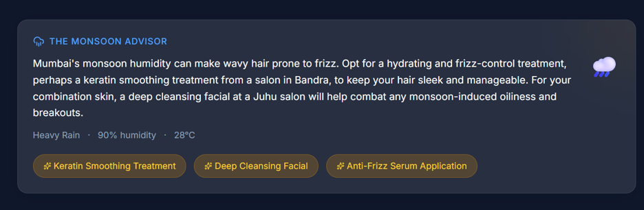


#### 2. AI Style Mirror
* **What is it:** A cutting-edge virtual consultation tool that suggests the best haircut and styling tailored to you.
* **Input:** Facial structure description, current hair length, and desired vibe.
* **Output:** AI-generated style recommendations, reference aesthetics, and a list of salons specializing in that exact cut.  
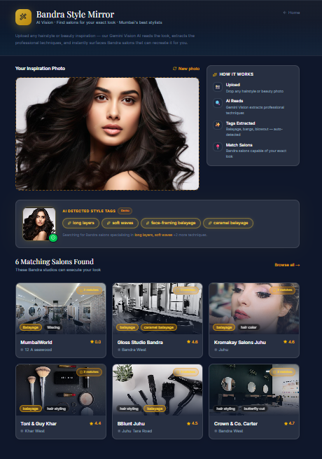

#### 3. AI Diagnostics Studio (Skin & Color Test)
* **What is it:** A comprehensive diagnostic engine analyzing your unique features to recommend the best color palettes and skincare routines.
* **Input:** User responses to skin type, undertone, and lifestyle quizzes.
* AI Diagnostics Studio
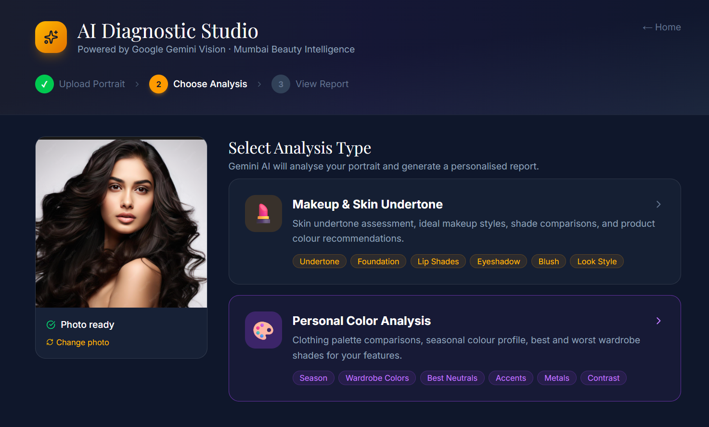
* **Output:** 
  * **A. Skin:** Personalized skincare routines, facial treatment recommendations, and product ingredients to avoid.     
 
 AI Diagnostics Studio:Skin Care Analysis  
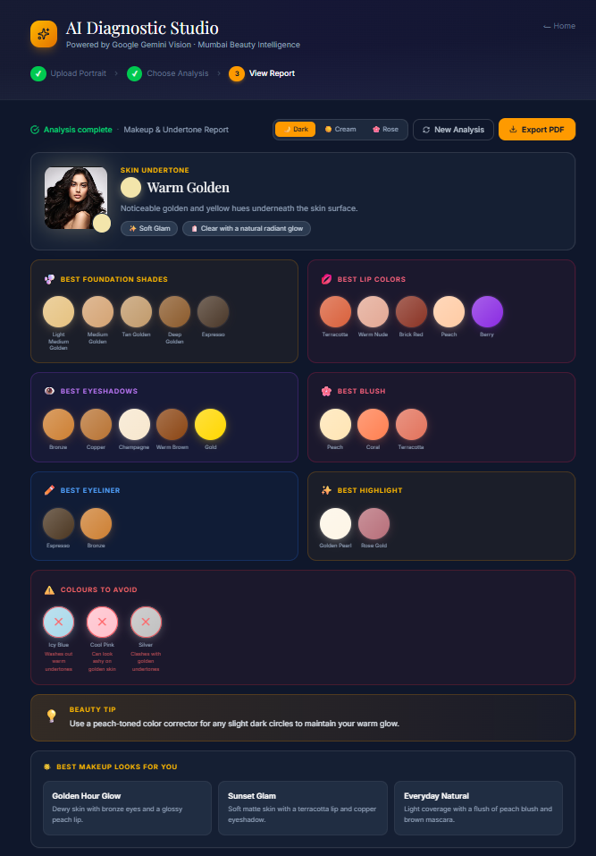

  * **B. Color Test:** Your exact "color season" profile and customized makeup/hair color suggestions that perfectly complement your complexion.    
 AI Diagnostics Studio:Color Analysis
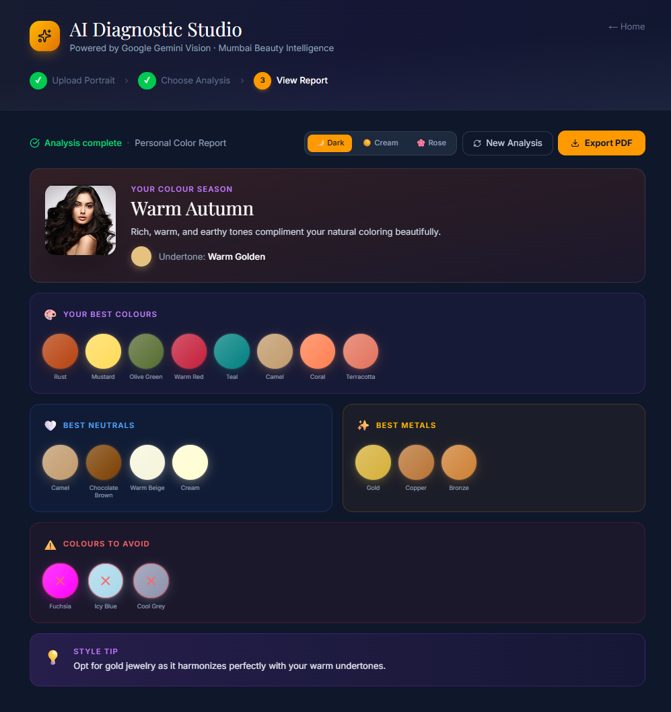


#### 4. AI Review Analysis | Sentiment Analysis
* **What is it:** An NLP-powered engine that reads hundreds of salon reviews instantly to give you the ultimate truth.
* **Input:** Raw user reviews for a specific salon.
* **Output:** A synthesized "Vibe Meter", Trust Score (filtering out fake reviews), and summarized insights ("Best for", "Watch out for").  
.png)

#### 5. Booking: Solo & Group
* **What is it:** A seamless booking interface that adapts whether you're going alone or planning a bridal party.
* **Input:** Desired date, time, services, and party size.
* **Output:** Instant appointment confirmation, dynamic pricing, and conflict-free scheduling with your chosen salon.  
* Salon Appointment Booking: Solo   
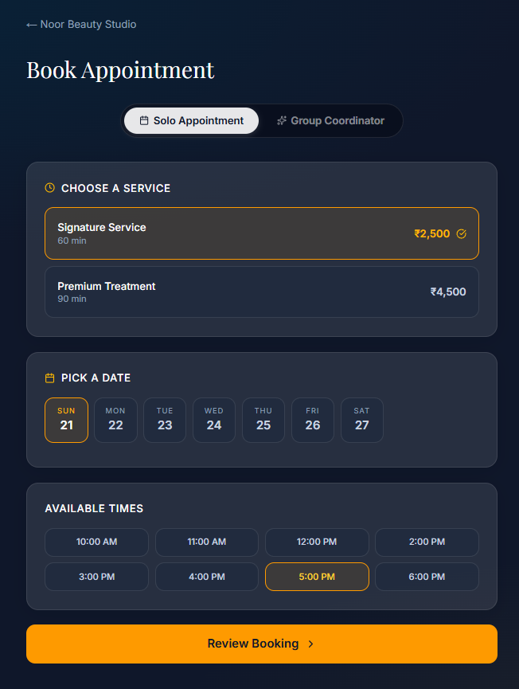
* Salon Appointment Booking: Group   
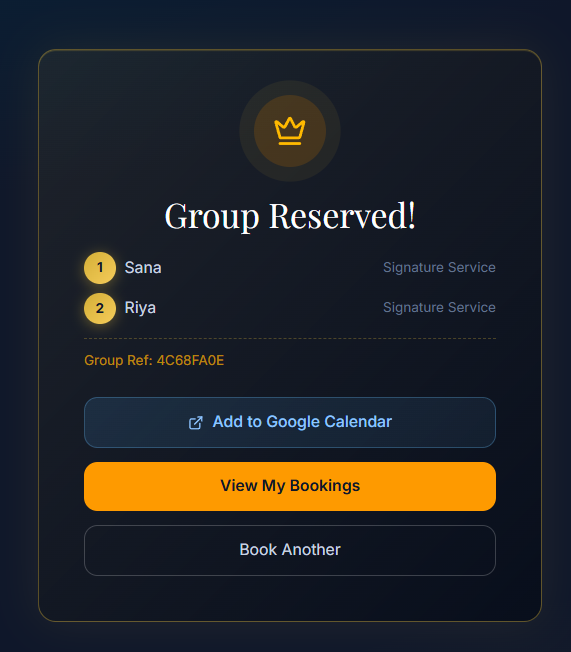

#### 6. Hair Care Tips (Smart Post-Treatment Feed)
* **What is it:** A dynamic and highly contextual feed generating precise hair maintenance regimes after every salon visit to protect your investment.
* **Input:** The user's exact diagnosed hair type, their recent salon treatments (e.g., Keratin, Balayage, Highlights), and local environmental factors like water hardness.
* **Output:** Step-by-step actionable routines, curated organic product recommendations, and automated reminders for touch-up appointments perfectly timed to extend the life of the treatment.
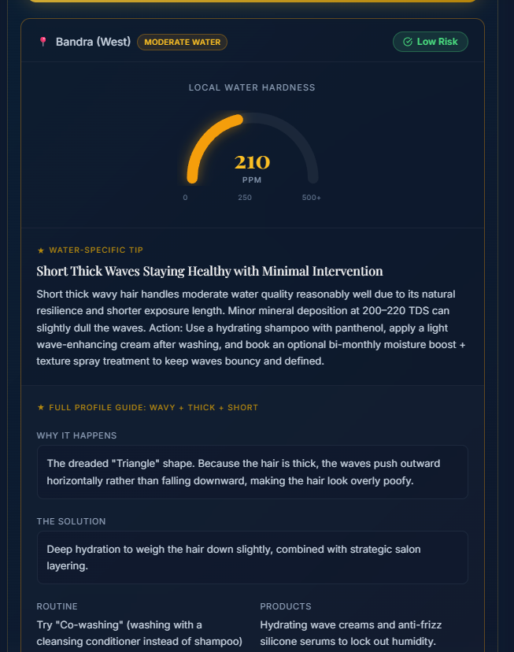
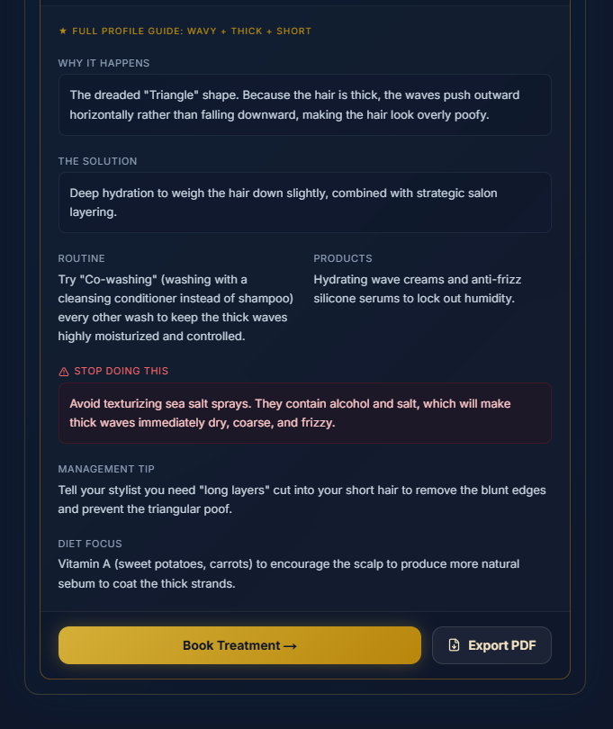


<br />

### For Salon Owners (Partners)

#### 1. Manage Bookings
* **What is it:** A robust daily calendar to organize and transition client appointments.
* **Input:** Incoming customer booking requests.
* **Output:** Organized columns tracking appointments by status: `Pending`, `Confirmed`, and `Completed` for accurate daily records.

#### 2. Manage Daily Customers & Analytics
* **What is it:** A high-level overview of the salon's daily financial and operational health.
* **Input:** Completed bookings and payment data.
* **Output:** An interactive dashboard displaying exactly how the business is doing: *Today's Customers*, *Total Appointments*, *Average Rating*, and *Total Revenue*.

#### 3. Update Profile Details Using AI
* **What is it:** An automated profile enhancement tool for owners.
* **Input:** Basic, raw descriptions of the salon and its services.
* **Output:** Beautifully written, SEO-optimized "About Us" sections and polished service descriptions generated by AI to attract high-end clientele.

#### 4. AI Review Analysis (Owner Dashboard)
* **What is it:** Insightful analytics to help owners understand customer sentiment and improve service.
* **Input:** Incoming customer ratings and textual reviews.
* **Output:** Actionable growth suggestions, top-performing assets, and specific friction points derived from NLP sentiment analysis.

---

## Project Setup & Installation

### Prerequisites
- Node.js (v18.17 or higher)
- Python (3.9 or higher)
- npm or yarn or pnpm
- A [Supabase](https://supabase.com/) Account (for Database & Auth)
- A [Google Gemini](https://aistudio.google.com/) API Key

### Step-by-Step Guide

**1. Clone the Repository**
```bash
git clone https://github.com/your-username/zuri-app.git
cd zuri-app
```

**2. Setup Environment Variables (.env.local)**
Create your environment file using the terminal:
```bash
# On Mac/Linux:
touch .env.local

# On Windows (PowerShell):
New-Item .env.local -ItemType File
```
Open `.env.local` and add your API keys:
```env
# Supabase Configuration
NEXT_PUBLIC_SUPABASE_URL="https://your-project-url.supabase.co"
NEXT_PUBLIC_SUPABASE_ANON_KEY="your-anon-key-here"

# Google Gemini AI Configuration
GEMINI_API_KEY="your-gemini-api-key-here"
```

**3. Install Frontend Dependencies**
```bash
npm install
npm install uuid @types/uuid
```

**4. Install Python Backend Dependencies (for NLP Analysis)**
```bash
pip install -r api/requirements.txt
```

**5. Run the Project (Dual Servers)**

*Start the Python NLP Backend:*
```bash
python -m uvicorn api.index:app --reload --port 8000
```

*Start the Next.js Frontend (Open a new terminal tab):*
```bash
npm run dev
```

Navigate to `http://localhost:3000` to view the application!

---

## Project Workflow

<div style="background: rgba(255,255,255,0.02); padding: 20px; border-radius: 12px; border: 1px solid rgba(255,255,255,0.1);">
<pre style="background: transparent; border: none; color: #cbd5e1; font-family: monospace;">
<span style="color: #60a5fa; font-weight: bold;">[ Landing Page ]</span>
        │
        ▼
<span style="color: #c084fc; font-weight: bold;">[ Authentication (Login / Signup) ]</span>
        │
        ├──► <span style="color: #fbbf24; font-weight: bold;">[ Customer Flow ]</span>
        │         ├──► Discover Salons
        │         ├──► AI Diagnostics (Skin/Color/Humidity)
        │         ├──► Booking Engine
        │         └──► View Hair Care Tips
        │
        └──► <span style="color: #34d399; font-weight: bold;">[ Salon Owner Flow ]</span>
                  ├──► Analytics Dashboard (Revenue/Footfall)
                  ├──► Appointments Management
                  ├──► AI Review Sentiment Dashboard
                  └──► Profile & Service Setup
</pre>
</div>

---

## UI Design Showcase

Here is a visual tour of the Zuri platform across the workflow.

- **1. Landing Page:**
  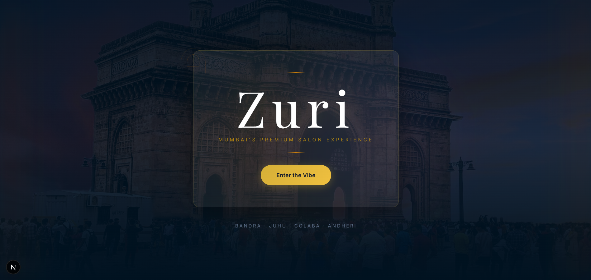
  
- **2. Authentication / Signup:**
  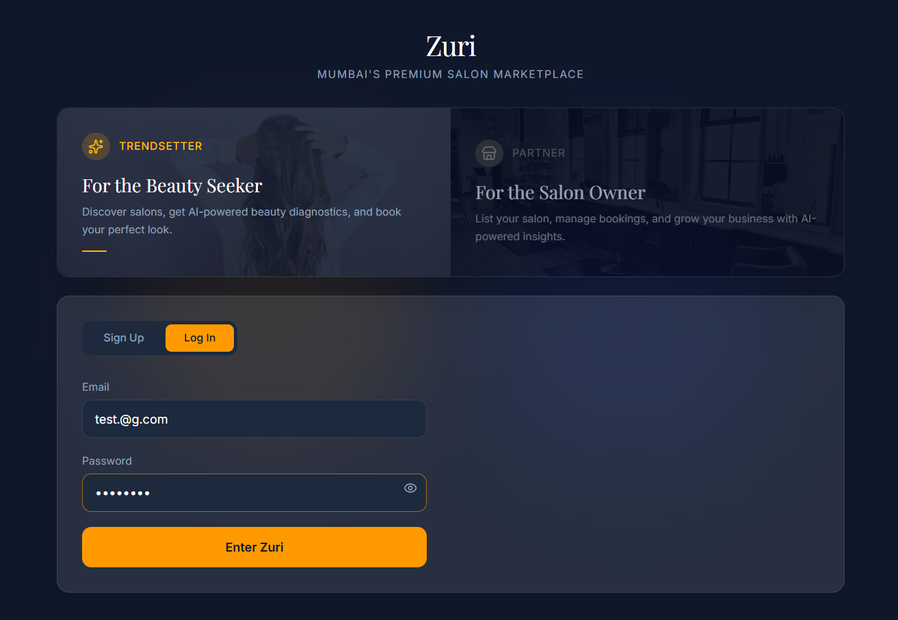

## User Side: Features

- **3.Customer Flow -  User Home Screen:**
  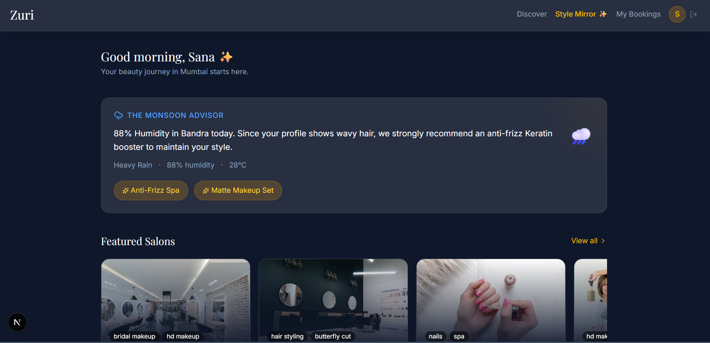
  
- **4. Customer Flow - Zuri AI Feature**
  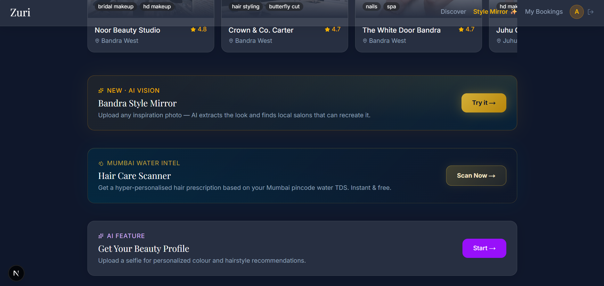
<!-- 
 ## AI  Based Features
- **5.Customer Flow - AI Hair Care Tips (input)**
  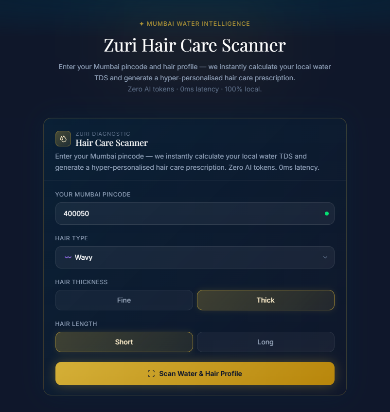

  **6. Customer Flow - AI Hair Care Tips (output)**
  
  

- **6.Customer Flow - AI Diagnostics Studio**
   
  
- **7.Customer Flow - AI Diagnostics Studio:Skin Care Analysis**
  

- **8.Customer Flow - AI Diagnostics Studio:Color Analysis**
  

- **9.Customer Flow - AI Bandra Style Mirror**
   

 **11. Customer Flow - Discover/ Search Salons**
  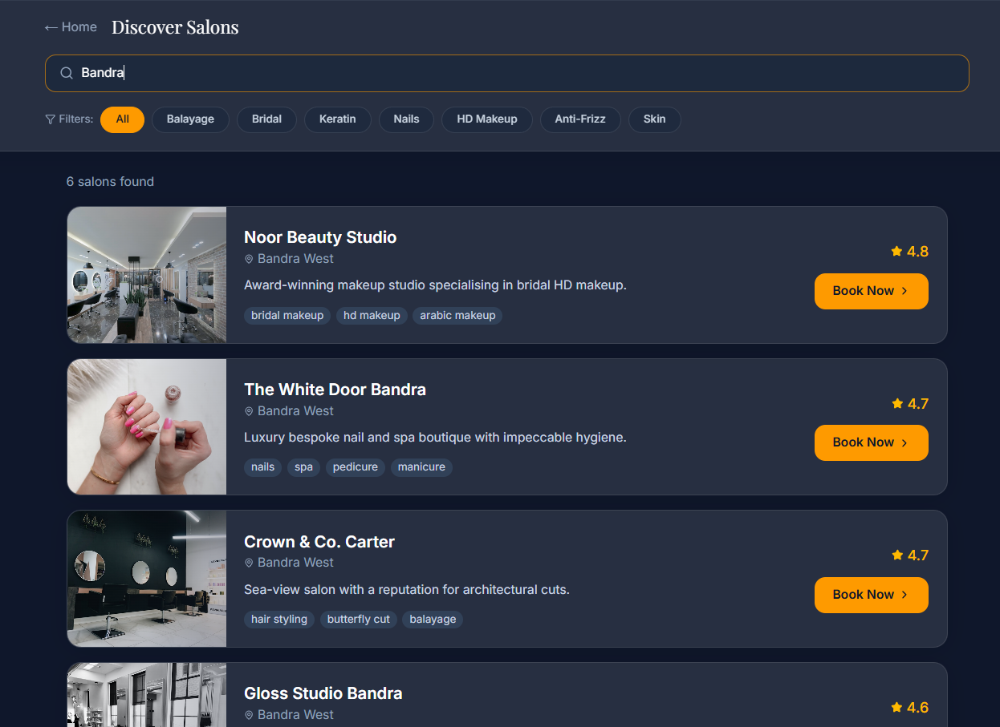

  **12. Customer Flow - Salon Profile**
  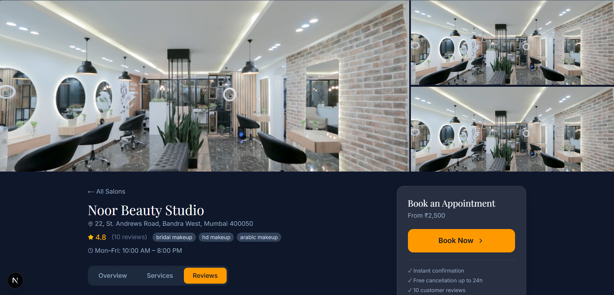

- **11.Customer Flow - AI Review Analysis|| Sentimental Analysis**
  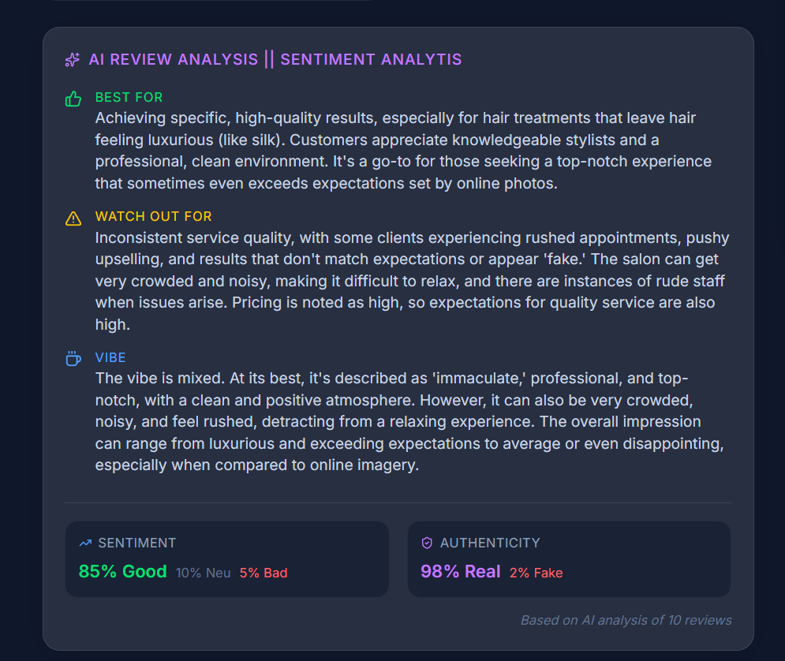

- **12.Customer Flow - Salon Appointment Booking: Solo**
  

- **13.Customer Flow - Salon Appointment Booking: Group**
   
-->

-## Salon side 
- **1. Salon Side - Salon Dashboard**
  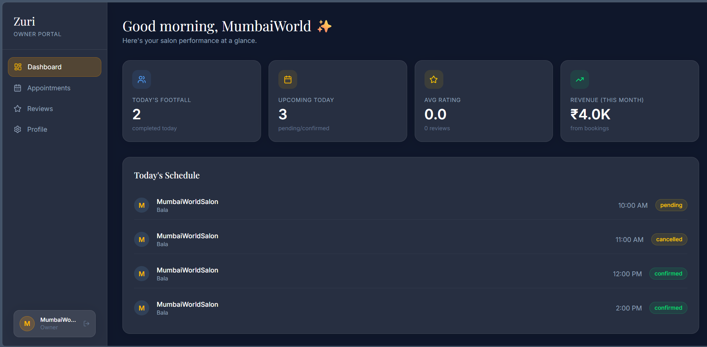

- **2. Salon Side - Appointment Details Dashboard(All Booking) **
  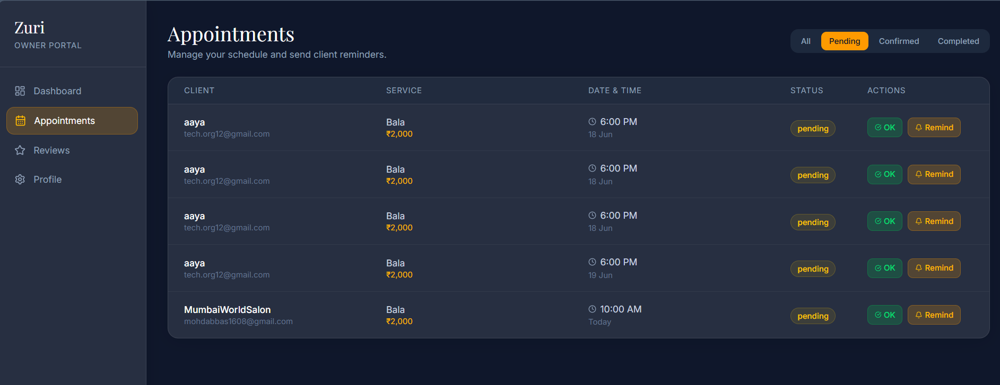

- **2. Salon Side - Appointment Dashboard (Confirmed Booking)**
  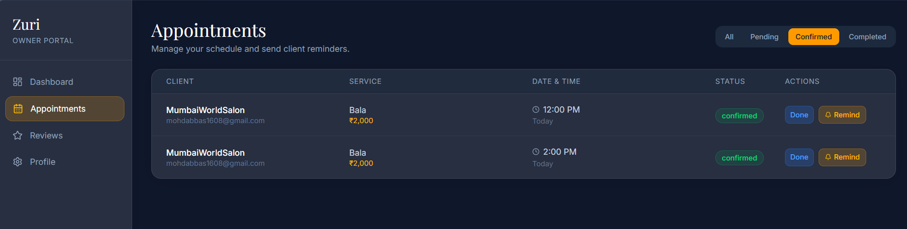

- **3. Salon Side -Appointment Booking Compeleted**
   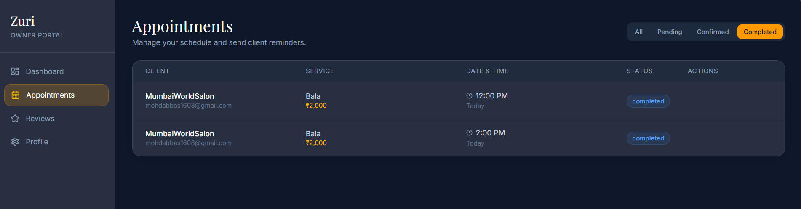

- **4.Customer Flow - AI Review Analysis**
  .png)

  


## Project Information

* **Version:** 1.0.0
* **Framework:** Next.js 15 (App Router)
* **Styling:** Tailwind CSS (Theme Accent: `#d4af37`)
* **Database & Auth:** Supabase
* **AI Provider:** Google Generative AI (Gemini Flash)
* **NLP Backend:** Python (FastAPI / Uvicorn)
* **Icons:** Lucide React

<br />

<div align="center">
  <p style="color: #d4af37; font-size: 16px; font-style: italic; font-weight: bold;">
    ✨ Elevating beauty through the precision of Artificial Intelligence. Where technology meets elegance. ✨
  </p>
</div>
